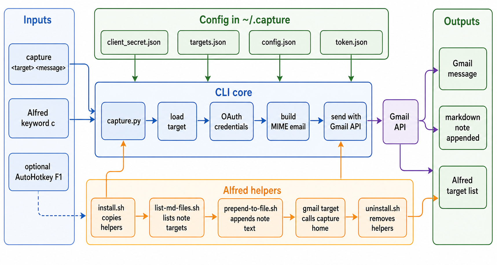

<div align="center">
  

  **🧠 Capture thoughts to Gmail before they become distractions ⚡**
</div>

capture is a small Python CLI for sending quick thoughts, reminders, and tasks to Gmail. It follows the Getting Things Done habit of getting ideas out of your head quickly so they can be processed later.

The repo also includes an Alfred workflow for macOS note capture. The workflow can append text to markdown notes or route a `gmail` target through the `capture` command.

## Install

```bash
uv tool install git+https://github.com/tsilva/capture.git
```

Create `~/.capture/client_secret.json` from a Google Cloud desktop OAuth client with the Gmail API enabled, then create `~/.capture/targets.json`:

```json
{
  "home": {
    "from": "you@gmail.com",
    "to": "you@gmail.com"
  },
  "work": {
    "from": "you@gmail.com",
    "to": "work@example.com"
  }
}
```

Send a thought:

```bash
capture home "Buy groceries after work"
```

On first use, the CLI opens a browser OAuth flow and stores Gmail tokens in `~/.capture/token.json`.

## Local Setup

```bash
git clone https://github.com/tsilva/capture.git
cd capture
uv tool install .
capture home "Test capture from a local install"
```

To install the Alfred workflow and helper scripts:

```bash
./install.sh
```

The installer copies helper scripts into `~/.capture/`, installs the Alfred workflow when Alfred is present, and creates `~/.capture/config.json` interactively when it does not already exist.

## Commands

```bash
capture <target> <message>                 # send a Gmail message through a target in targets.json
./install.sh                               # install Alfred workflow helpers
./uninstall.sh                             # remove Alfred workflow helpers, keeping CLI config
uv tool uninstall capture-cli              # uninstall the CLI
```

## Notes

- Runtime config lives in `~/.capture/` on every platform.
- `client_secret.json` and `targets.json` are required before the CLI can send mail.
- `config.json` is used by the Alfred workflow and stores `notes_dir` and `repos_dir`.
- The CLI uses the Gmail compose scope and sends each captured message as both the email subject and body.
- Alfred uses the `c` keyword to list markdown note targets and the special `gmail` target.
- Markdown note capture appends text to `<notes_dir>/<note-name>.md`; new notes start with `#process`.
- Files named `git-<repo>.md` can use `<repos_dir>/<repo>/logo.png` as their Alfred icon.
- The included AutoHotkey example can bind quick capture on Windows after the CLI is installed.

## Architecture



## License

[MIT](LICENSE)
